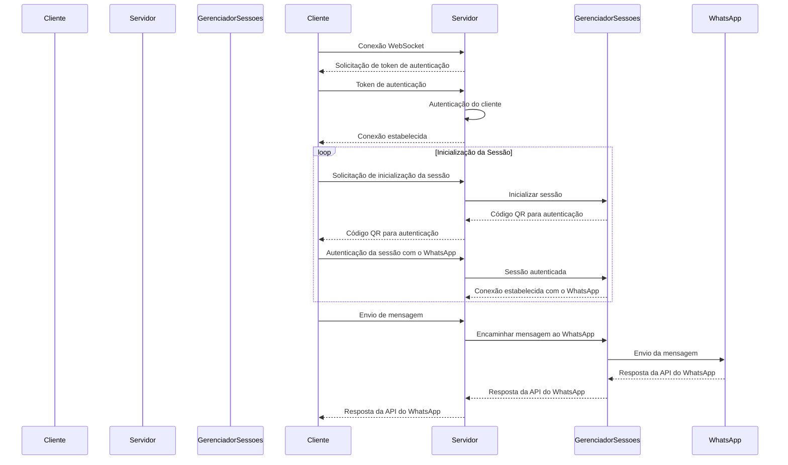

# Diagrama de Sequência: Interação entre Cliente, Servidor WebSocket e WhatsAppSessionManager

A seguir, apresenta-se um diagrama de sequência que ilustra o fluxo de interação entre o cliente, o servidor WebSocket e o WhatsAppSessionManager durante o processo de inicialização de uma sessão do WhatsApp e o envio de mensagens:

**Descrição do Diagrama de Sequência:**

1. O cliente WebSocket estabelece uma conexão com o servidor WebSocket.
2. O servidor WebSocket solicita ao cliente um token de autenticação para autenticar a conexão.
3. O cliente envia o token de autenticação para o servidor WebSocket.
4. O servidor WebSocket autentica o cliente usando o middleware `AuthMiddleware`.
5. A conexão é estabelecida entre o cliente WebSocket e o servidor WebSocket.
6. O cliente solicita a inicialização de uma sessão do WhatsApp.
7. O servidor WebSocket chama o método `initializeSession` do WhatsAppSessionManager para criar uma nova sessão do WhatsApp.
8. O WhatsAppSessionManager gera um código QR para autenticação e o envia de volta para o servidor WebSocket.
9. O servidor WebSocket envia o código QR para o cliente WebSocket.
10. O cliente autentica a sessão do WhatsApp, escaneando o código QR.
11. O servidor WebSocket recebe a confirmação de autenticação do cliente e informa o WhatsAppSessionManager que a sessão foi autenticada.
12. O WhatsAppSessionManager estabelece uma conexão com o WhatsApp.
13. O cliente WebSocket envia uma mensagem para o servidor WebSocket.
14. O servidor WebSocket encaminha a mensagem para o WhatsAppSessionManager.
15. O WhatsAppSessionManager envia a mensagem para o WhatsApp.
16. O WhatsApp processa a mensagem e envia uma resposta de confirmação de envio de mensagem para o WhatsAppSessionManager.
17. O WhatsAppSessionManager envia a resposta de confirmação para o servidor WebSocket.
18. O servidor WebSocket envia a resposta de confirmação para o cliente WebSocket.

Esse diagrama de sequência ilustra a interação entre o cliente WebSocket, o servidor WebSocket e o WhatsAppSessionManager durante a inicialização de uma sessão do WhatsApp e o envio de mensagens. Ele mostra como as mensagens são encaminhadas entre as camadas da aplicação e como as respostas são retornadas ao cliente WebSocket após o processamento pelo WhatsApp. Essa interação em tempo real é fundamental para a funcionalidade completa da aplicação de gerenciamento de sessões do WhatsApp.